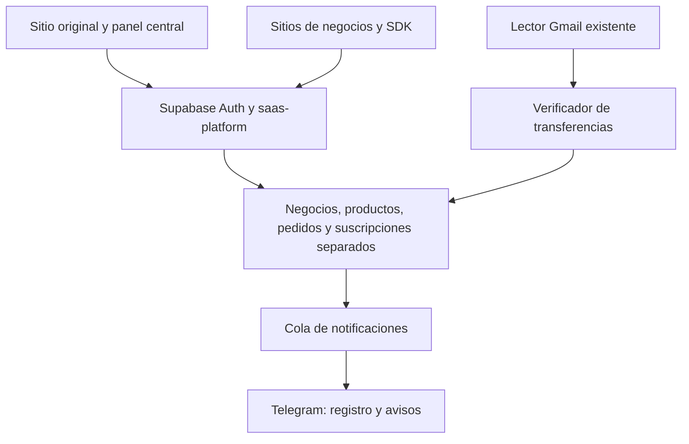

# Arquitectura

## Componentes y autoridad

| Componente | Responsabilidad | Autoridad |
|---|---|---|
| Panel original | Acceso al módulo central y catálogo digital | Permisos existentes; la API vuelve a verificar |
| Panel de plataforma | Contratos BOT/WEB, precios, clientes y configuración del negocio | JWT de Auth; is_catalog_admin para creador |
| Plantilla de comida | Mostrar catálogo, formar pedido y guardar borrador | Solo datos públicos de su negocio |
| saas-platform | Identidad, límites, validación, órdenes y notificaciones | service_role solo dentro de Edge |
| saas_private | Aislar datos, importes, stock y estados | RLS sin permisos para clientes directos |
| gmail-oauth | OAuth/IMAP, cifrado y pruebas de autenticidad del banco | Identidad real y suscripción existente |
| Verificador ampliado | Comparar referencia, importe, banca, destinatario y prueba DKIM | Llamada de servidor, nunca un comprobante del cliente |
| Registro de Telegram | El mismo user_id tras /vincular | ID numérico verificado por el webhook |
| GitHub Actions | Materializar carpetas de sitios activos | Secreto de Actions; nunca un token público |

El cliente no controla p_actor ni p_admin. Las operaciones públicas están enumeradas; el resto exige getUser y rol real. El schema privado no se expone directamente. La API no tiene una acción que acepte "ya pagué" para confirmar un pago.

## Suscripciones

Una cuenta puede tener BOT y uno o varios sitios WEB. Cada pago tiene factura y referencia de la secuencia global, evitando colisiones con pedidos anteriores. BOT-/WEB- son prefijos visuales; la referencia para SPEI es numérica. La primera aprobación habilita 30 días. Repetir la misma aprobación no vuelve a extender la vigencia. Las renovaciones crean otro pago. Desactivar el bot usa los controles de acceso existentes; pagar no elimina esa suspensión.

La suscripción BOT se guarda en bot_subscriptions y su pago confirmado también se refleja en bot_invoices para las listas e historial existentes de Telegram. La suscripción WEB pertenece a un site_id; no concede permisos sobre otros sitios. El seguimiento de tickets existentes sigue disponible aunque el negocio ya no pueda tomar pedidos.

## Estados

| Área | Estados | Cambios permitidos |
|---|---|---|
| Pago BOT/WEB | pending, confirmed, denied, false | Verificador confirma; creador decide con motivo |
| Pago de pedido | pending, confirmed, denied, false | Verificador confirma; dueño revisa con motivo |
| Entrega | new, accepted, delivered, cancelled | Solo pedido confirmado; aceptar antes de entregar |
| Acceso BOT | activo, vencido, suspendido, creador | Vigencia/control existente, creador ilimitado |
| Acceso WEB | activo, vencido, desactivado | expires_at y enabled verificados en servidor |

Sin referencia o con datos diferentes el pago permanece pendiente. No se asigna a una orden solo por coincidencia de importe; dos compras de $38 requieren referencias distintas. No existe aprobación automática de otras bancas hasta añadir y probar su parser.

## Domicilios, precios y ticket

El negocio tiene un pin persistente. El cliente puede recoger o marcar otro pin para domicilio; el GPS solicita precisión alta, informa el margen y permite ajuste manual. La plantilla inicial usa distancia lineal, no ruteo vial. La API recalcula precios desde su tabla de productos; reserva stock dentro de la transacción. La clave privada del pedido hace idempotente un reintento sin volver a descontar stock y permite recuperar el ticket al cambiar de aplicación.

Los tickets incluyen marca/logo, folio, fecha, contacto, detalle, entrega, referencia, total y estado. El PDF usa tabla vectorial con salto de página cuando hace falta, sin recortar capturas. JPEG usa captura del ticket completo. Las fotos del negocio deben permitir acceso CORS para incluirlas en exportaciones.

## Límites operativos

- Implementación inicial con una plantilla FOOD. Añadir otro tipo requiere plantilla y validación nuevas; no se anuncian plantillas inexistentes.
- Propietario del negocio y creador de la plataforma administran el sitio. Los permisos de colaboradores del sistema original no se transfieren automáticamente a otro negocio.
- Para publicar exactamente /slug/ bajo github.io, se necesita el repositorio raíz del usuario; dentro de un repositorio de proyecto se conserva su prefijo.
- La publicación de carpetas requiere Actions configurado. La suscripción se activa en base de datos inmediatamente; Pages puede tardar en publicar la carpeta.
- Cron Gmail, cola Telegram y Secrets deben instalarse en Supabase. Estos archivos no hacen despliegues remotos por sí solos.
- Las imágenes del catálogo son URL HTTPS; no se incluye almacenamiento de imágenes por negocio en esta entrega.
